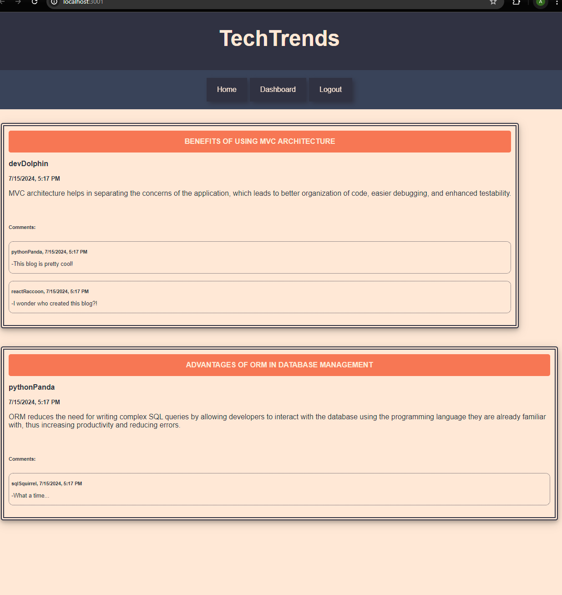

# TechTrends

TechTrends is a CMS-style blog platform designed for developers to publish blog posts, comment on fellow developers' content, and actively engage with the developer community.

- Users can sign up by creating a username and password, then log in to access their account, and log out when they're done using the site.

- The homepage allows you to browse through existing blog posts, displaying their titles and creation dates.

- In your dashboard, you can view all the posts you've written, as well as create, update, or delete your posts.

- Ready to share a new post? Simply click on "Create New Post", enter a title and your content, and you're all set! If you need to edit or delete a post later on, you can easily do that as well!

- Users can read comments on any blog post to see what others are saying about it.

- Want to join the conversation? Leave a comment on a post while you're logged in!

- Easily return to the homepage with a click. Access your personal dashboard to manage your posts, and log out with just one click when you're done.

## Installation

To install TechTrends:

- Clone the repository: https://github.com/AcoderRose/TechTrends

- Go to the project directory

- Launch the terminal and install the dependencies by executing the following command: `npm install`

- Set up the PostgreSQL database with the following commands:

  - Input `psql -U postgres` to open the PostgreSQL command line interface. If prompted, input your password.
  - To set up the database, type `\i schema.sql` and press Enter.
    Now your database is set up correctly!

- Remove '.EXAMPLE' from the .env.EXAMPLE file renaming it to .env

- Configure that .env file with your database credentials

- Seed data to your database, in the terminal by executing the following command: `npm run seed`

## Usage

- Start the application, in the terminal by executing the following command: `npm start`

 

## Credits

[Kaila Ronquillo](https://github.com/girlnotfound)

[Ryan Petersen](https://github.com/RyanPetersen-89)
